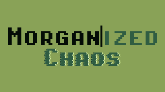

<h1 align="center"></h1>

Morganized Chaos is a typing game where you play as Morgan, who has just entered their first game jam and now must start brainstorming and developing their first game. 

It's the first day of the jam, it's time to get to work, log in and check the to-do app for tasks. Try to complete all the tasks before the end of the day, or don't, that's okay too, there's always tomorrow. You may think you have plenty of time today, but be wary, time moves quickly for Morgan. Additionally, Morgan's mind can sometimes jump around, so pay attention to what needs to be typed, since mistakes cost time. 

## Screenshots

 
 

## Credits
#### Audio
- [NK Cream](https://github.com/hainguyents13/mechvibes/tree/main/src/audio/nk-cream) by Hai Nguyen, licensed under [MIT](https://opensource.org/license/mit)
- [Universal UI Soundpack](https://cyrex-studios.itch.io/universal-ui-soundpack) by Nathan Gibson, licensed under [CC BY 4.0](https://creativecommons.org/licenses/by/4.0/)
- [computer humming](https://pixabay.com/sound-effects/computer-humming-236384/) by Soul_Serenity_Sounds, licensed under [Pixabay Content License](https://pixabay.com/service/license-summary/)
- [Glitch Noises](https://vladislavzh.itch.io/glitch-noises) by Vladislav Zharkov, licensed under [CC0 1.0](https://creativecommons.org/publicdomain/zero/1.0/)
#### Fonts
- [Pixel Operator](https://www.dafont.com/pixel-operator.font) by Jayvee Enaguas, licensed under [CC0 1.0](https://creativecommons.org/publicdomain/zero/1.0/)
#### Shaders
- [Glitch Effect Shader](https://godotshaders.com/shader/glitch-effect-shader-for-godot-engine-4/) by Yui Kinomoto, licensed under [MIT](https://opensource.org/license/mit)

Everything else by me, made with Godot & LibreSprite

UI inspired by windows 95, with a [colour palette](https://lospec.com/palette-list/ammo-8) swap 

## License
Morganized Chaos is licensed under the [GNU General Public License v3.0 (GPLv3)](LICENSE).
